# Artificial Intelligence - Search Algorithms

<h3>📺 Apresentação </h3>

    

        <h5>Instituto de Ciências Matemáticas e de Computação - USP São Carlos</h5>
        
        <h5 style="font-size:6px;">Maio 2020</h5>
    

    

    <h5>Desenvolvido por: Leonardo Altemari Nogueira</h5>
    

<h4>📋 Para acessar a documentação completa com a descrição da implementação
	de cada algoritmo em particular, acesse:</h4>
<a href="https://docs.google.com/document/d/1O4pdOBr0iXWtJWLRaAJXEf1v2Dy2kNHazkwaas4fBUQ/edit?usp=sharing">Documentação Completa</a>
  

O projeto é  um trabalho de graduação da disciplina de Inteligência Artificial do curso de Ciências da Computação da USP de São Carlos.

No projeto, foram implementados 5 algoritmos de buscas, que foram aplicados em um labirinto para melhor visualização do usuário.

Foi criado também uma interface para que o usuário consiga escolher o labirinto(mapa) que deseja aplicar os algoritmos e também qual algoritmo deseja aplicar naquele mapa.

Escolhido o mapa e o algoritmo, o back-end da aplicação retorna para o usuário, na parte inferior da interface alguns dados, como o caminho gerado pelo algoritmo, a distancia desse caminho e o tempo que o algoritmo demorou para calcular este caminho

<h4><b>Interface:</b></h4>

    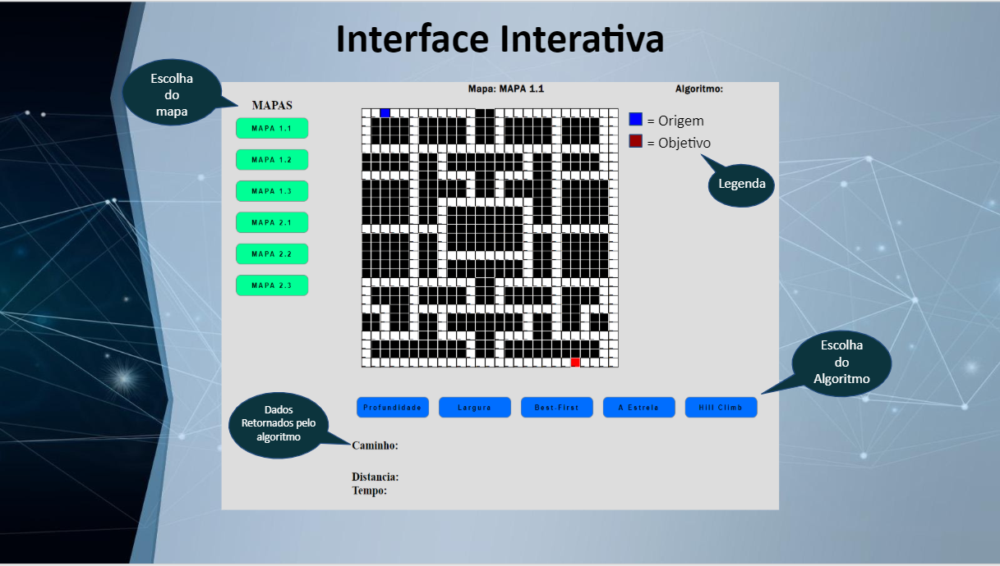

<h3>💻 Algoritmos </h3>
<h4>🚩 Buscas Cegas:</h4>
<ul style="list-style-type:none;">
    <li>
        <h5>➡️ Busca em Profundidade</h5>
        

            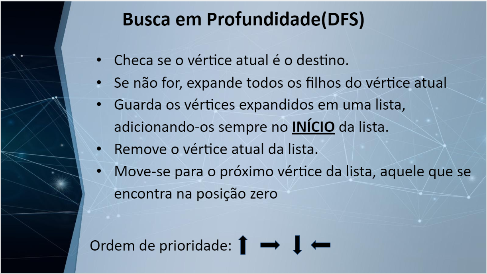
            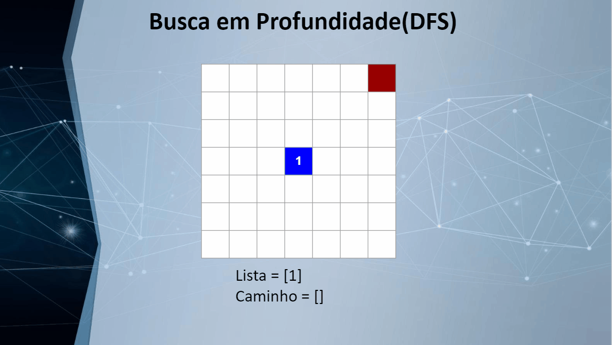
        

    </li>
    <li>
        <h5>➡️ Busca em Largura</h5>
        

            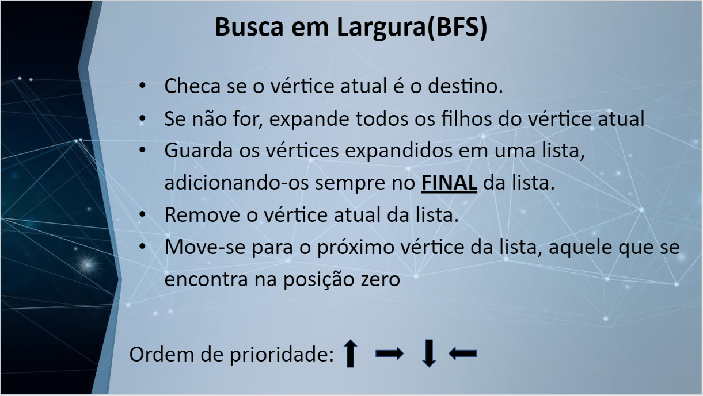
            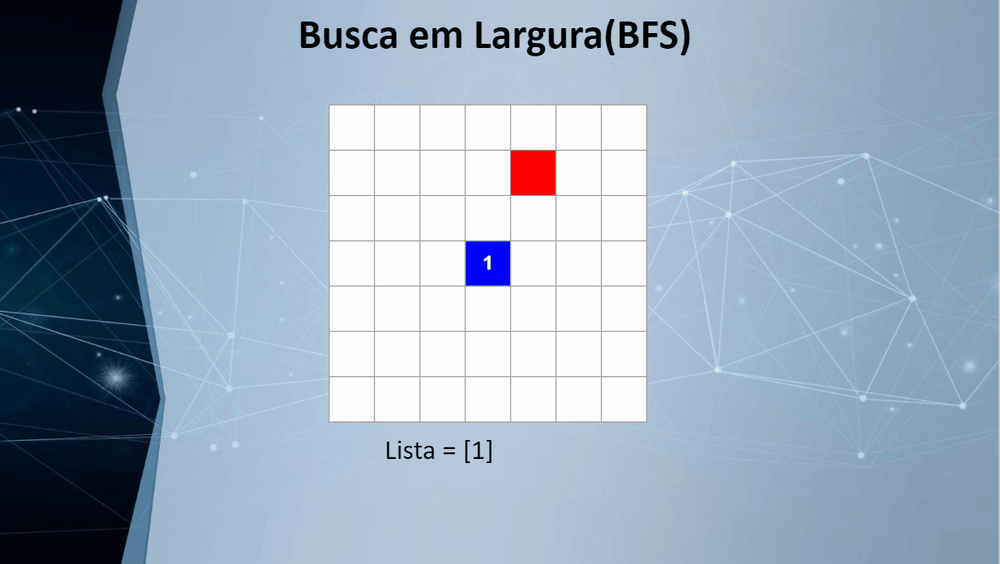
        

    </li>
</ul>

<h4>🚩 Buscas Informadas:</h4>
<ul style="list-style-type:none;">
    <li>
        <h5>➡️Busca Best-First</h5>
        

            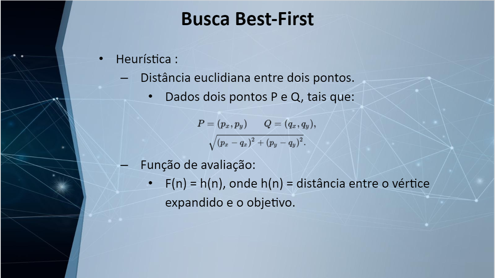
            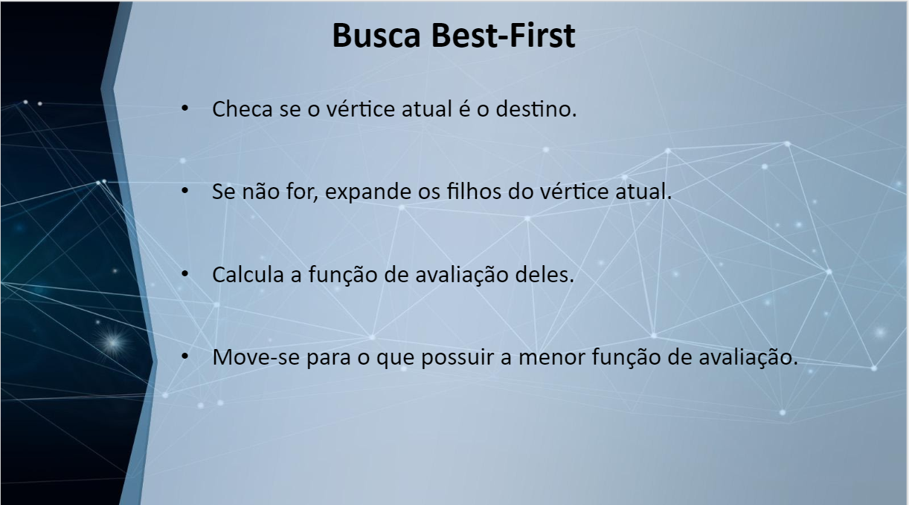
            <h5>Best-First sem obstáculos</h5>
            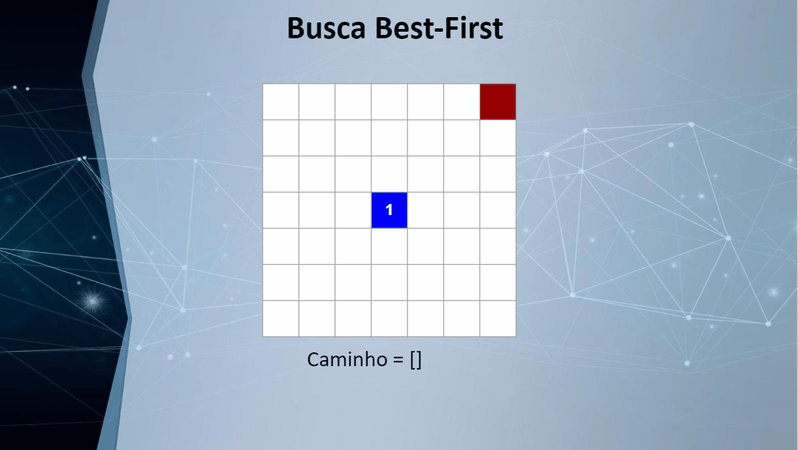
            <h5>Best-First com obstáculos</h5>
            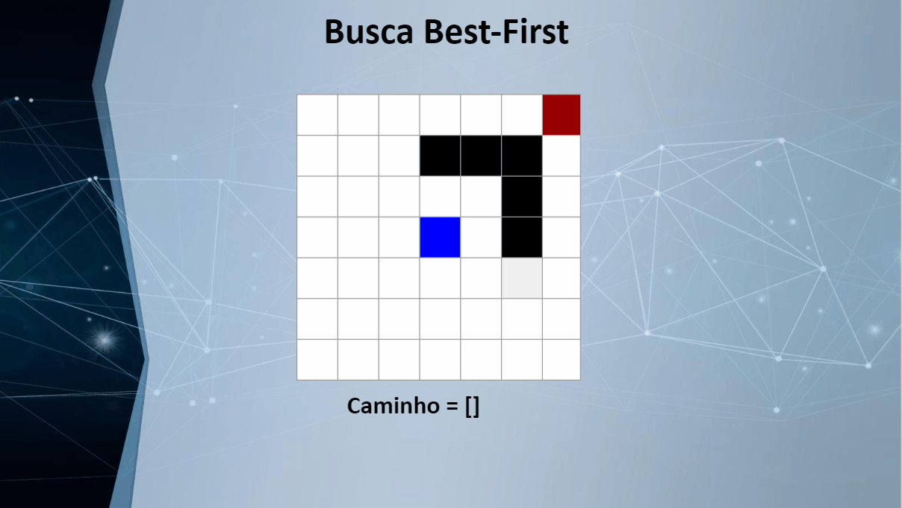
        

    </li>
    <li>
        <h5>➡️ Busca A*(A estrela)</h5>
        

            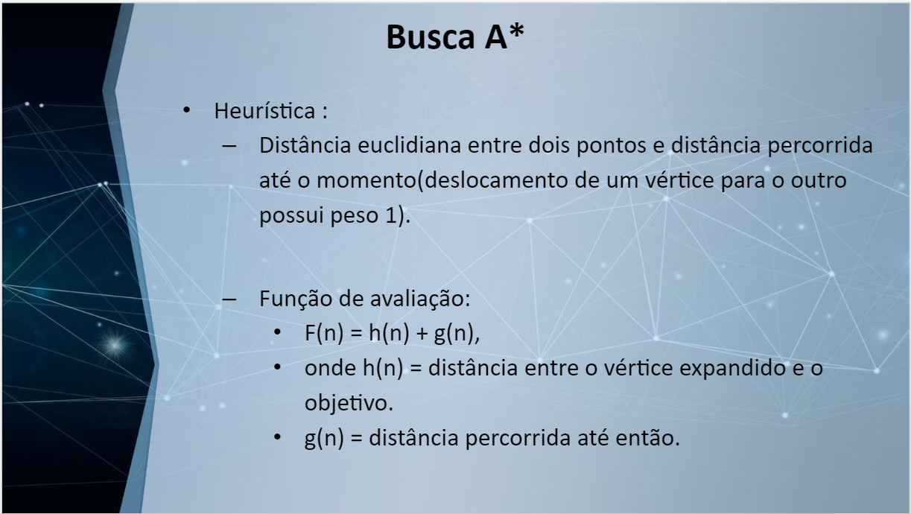
            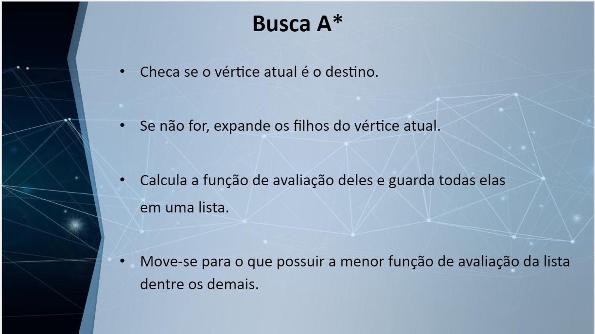
            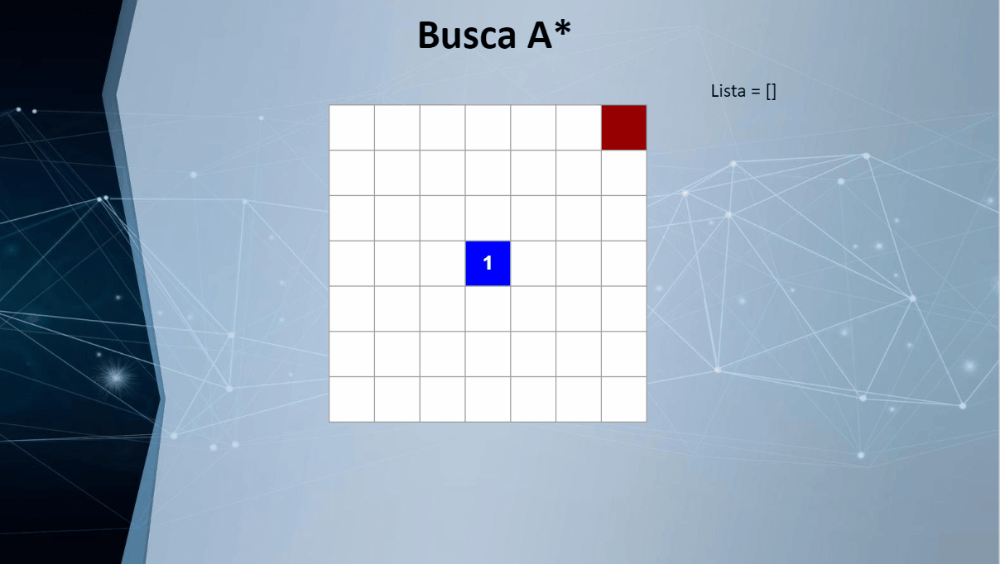
        

    </li>
    <li>
        <h5>➡️ Busca Hill Climbing</h5>
        

            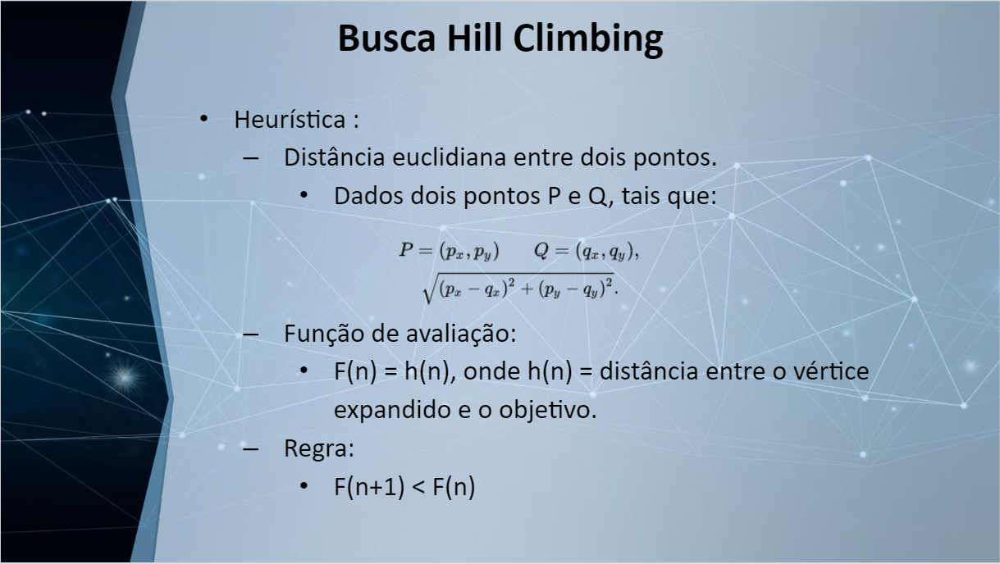
            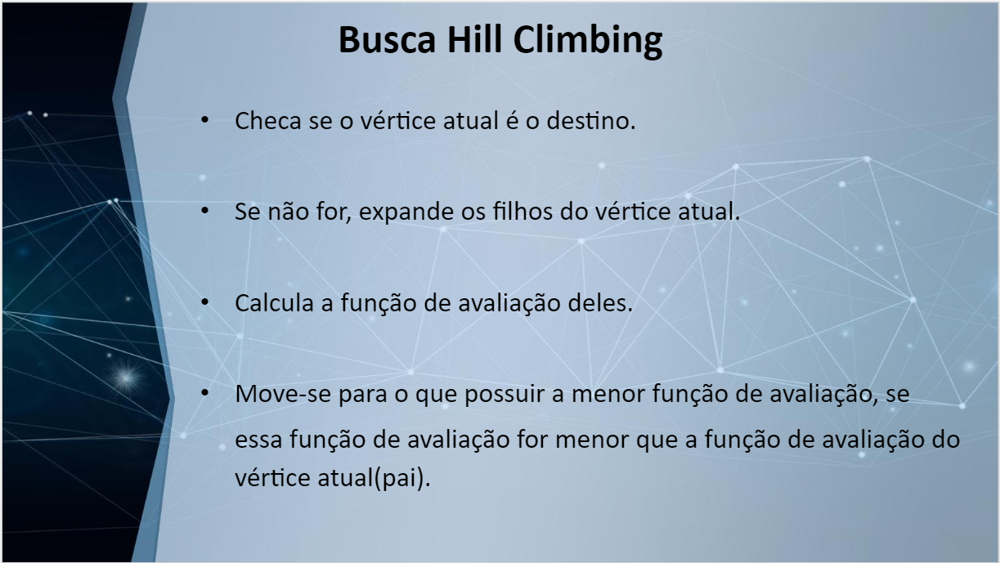
            <h5>Hiill Climbing sem obstáculos</h5>
            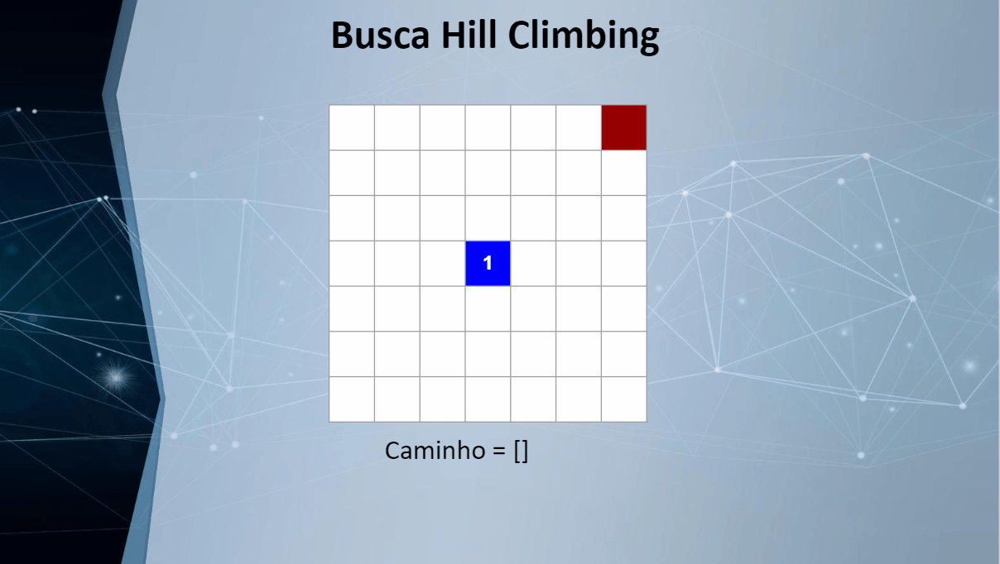
            <h5>Hiill Climbing com obstáculos</h5>
            
        

    </li>
</ul> 

<h3>🕙 Tempo dos algoritmos </h3>

    <h4>Tempo despendido por cada algoritmo em segundos:</h4>
    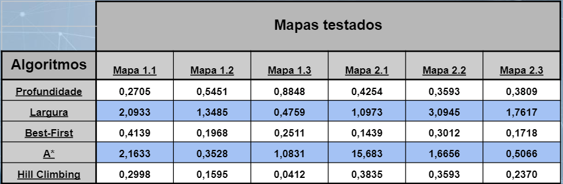

<h3>🚀  Tecnologias utilizadas </h3>
<ul>
    <li>
        <a  href="https://nodejs.org/en/" target="blank">Node.js</a>
    </li>
    <li>
        <a  href="https://expressjs.com/pt-br/" target="blank">Express</a>
    </li>
    <li>
        <a  href="https://developer.mozilla.org/pt-BR/docs/Web/HTML" target="blank">HTML 5</a>
    </li>
    <li>
        <a  href="https://developer.mozilla.org/pt-BR/docs/Web/CSS" target="blank">CSS 3</a>
    </li>
    <li>
        <a  href="https://developer.mozilla.org/pt-BR/docs/Aprender/JavaScript" target="blank">JavaScript(ES6)</a>
    </li>
</ul>

<h3>🔥 Instalação e inicialização</h3>
<ul>

Para compilar e executar o código, é necessário ter instalado no computador o Node.js já que a interface é montada em cima de requisições em um servidor local, para renderizar um mapa escolhido ou executar um dos algoritmos no mapa. 

	<li><b>1º)</b> Link para instalar o Node JS: https://nodejs.org/en/download/</li>
	<li><b>2º)</b> Baixe e execute o instalador para seu Sistema Operacional.</li>
	<li><b>3º)</b> Feito isso, abra a pasta do projeto “IA_Search_Algorithms” no terminal, se estiver no windows, utilize o powershell ou o terminal do VSCode.</li>
	<li><b>4º)</b> Com o terminal aberto, digite o seguinte comando “npm install” para instalar as dependências do projeto e aguarde elas serem instaladas.</li>
	<li><b>5º)</b> Ainda na pasta do projeto pelo terminal, digite o comando “npm start”.</li>
	<li><b>6º)</b> Feito isso o servidor é pra estar rodando e ele mostrará a seguinte mensagem no terminal: “Servidor rodando, acesse http://localhost:8080/”.</li>
	<li><b>7º)</b> Abra o link no navegador:  http://localhost:8080/ .</li>
	<li><b>8º)</b> Selecione um mapa antes de aplicar qualquer algoritmo.</li>
</ul>

<h3>📘 Referências</h3>
<ul>
    <li>
        <a href="https://ae4.tidia-ae.usp.br/access/content/group/b93e2a33-c2e8-4c69-b64a-c4b49e5f08e0/06-07.%20Prolog_busca.pdf">https://ae4.tidia-ae.usp.br/access/content/group/b93e2a33-c2e8-4c69-b64a-c4b49e5f08e0/06-07.%20Prolog_busca.pdf</a>
    </li> 
    <li>
        <a href="http://www.ic.uff.br/~ilaim/IA5.pdf">
        http://www.ic.uff.br/~ilaim/IA5.pdf
        </a>
    </li> 
    <li>
        Seções 2.3 e 3.4 : 
        <a href="http://www.monografias.poli.ufrj.br/monografias/monopoli10019618.pdf">http://www.monografias.poli.ufrj.br/monografias/monopoli10019618.pdf
        </a>
    </li>
</ul>

